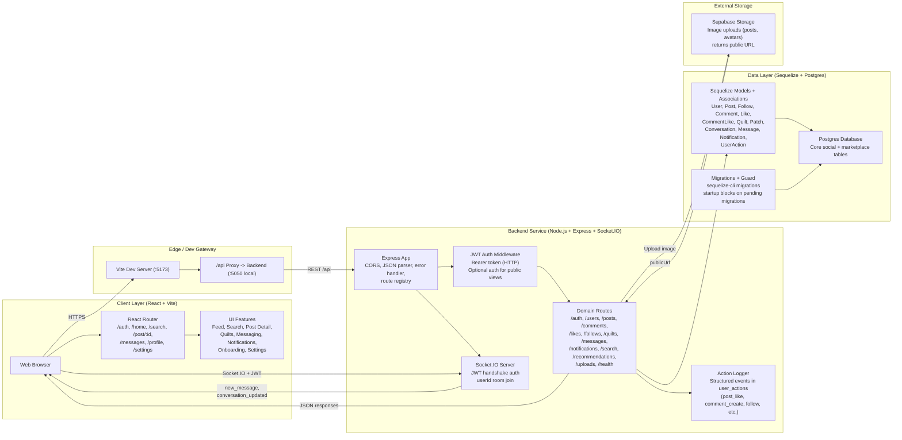

# Patchwork One-Page Architecture Diagram

## Notes

- Recommendations are currently a chronological fallback feed (not personalized yet).
- Notification UI polls periodically via REST; chat updates are real-time via Socket.IO.
- Uploads are optional at runtime: if Supabase env vars are missing, `/api/uploads` is disabled.
