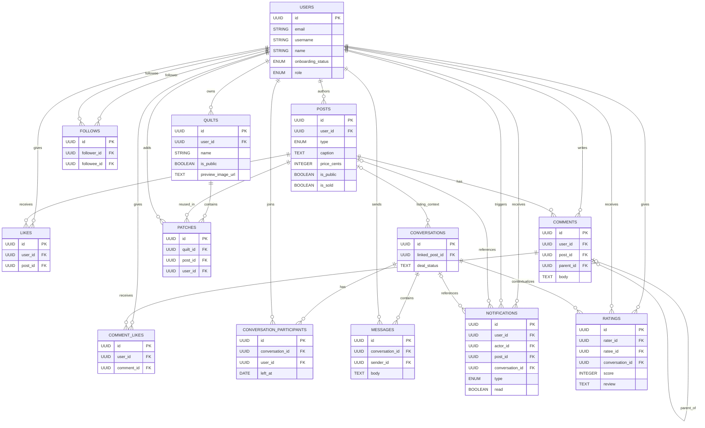
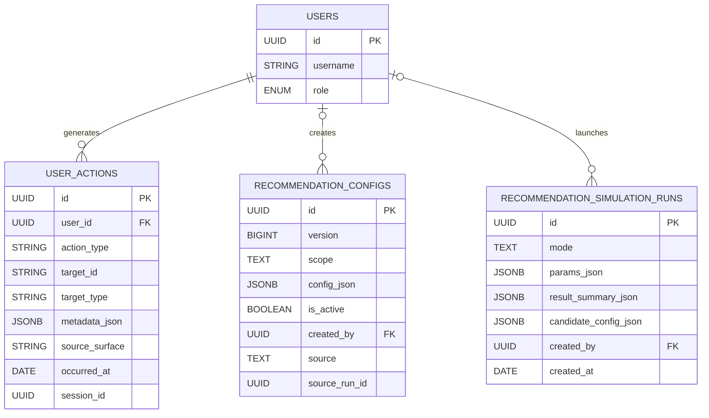

# Patchwork Database Diagram

This diagram is based on the implemented Sequelize schema in [server/src/models/index.js](/Users/jacklund/Documents/CS/CS422/Patchwork/server/src/models/index.js) plus the recommendation/admin migrations in:

- [20260219-0009-add-recommendation-config-history.js](/Users/jacklund/Documents/CS/CS422/Patchwork/server/migrations/20260219-0009-add-recommendation-config-history.js)
- [20260219-0010-add-recommendation-simulation-runs.js](/Users/jacklund/Documents/CS/CS422/Patchwork/server/migrations/20260219-0010-add-recommendation-simulation-runs.js)

For presentation use, the schema is split into two diagrams so the slide stays readable.

## Core Application Schema

## Recommendation and Admin Extension

## Presentation Notes

- Use the **Core Application Schema** on a slide if you want to explain how Patchwork supports social posting, quilts, marketplace messaging, notifications, and ratings in one database.
- Use the **Recommendation and Admin Extension** only if you want to show technical depth around analytics and recommendation tuning.
- `user_actions.target_id` and `user_actions.target_type` are intentionally modeled as polymorphic event references, so they are not drawn as hard foreign keys to a single table.
- `recommendation_configs.source_run_id` is a logical reference to a simulation run, but it is not enforced as a database foreign key.
- Several tables contain more fields than shown here, especially `users` and `posts`. The diagram keeps only the most presentation-relevant attributes so it stays readable.
