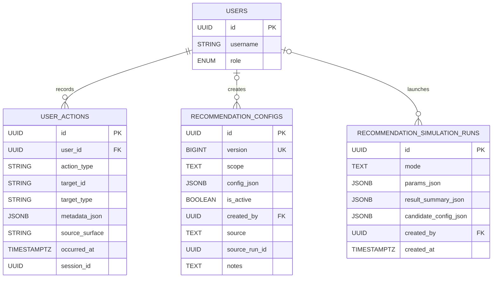

# Patchwork Database Diagram

This ERD reflects the current Patchwork Postgres schema as implemented in [server/src/models/index.js](/Users/jacklund/Documents/CS/CS422/Patchwork/server/src/models/index.js) and extended by the key schema migrations below:

- [20260210-0001-create-core-schema.js](/Users/jacklund/Documents/CS/CS422/Patchwork/server/migrations/20260210-0001-create-core-schema.js)
- [20260211-0004-add-post-feature-richness.js](/Users/jacklund/Documents/CS/CS422/Patchwork/server/migrations/20260211-0004-add-post-feature-richness.js)
- [20260216-0006-add-image-urls-array.js](/Users/jacklund/Documents/CS/CS422/Patchwork/server/migrations/20260216-0006-add-image-urls-array.js)
- [20260216-0006-add-user-role-admin.js](/Users/jacklund/Documents/CS/CS422/Patchwork/server/migrations/20260216-0006-add-user-role-admin.js)
- [20260218-0008-add-ratings-system.js](/Users/jacklund/Documents/CS/CS422/Patchwork/server/migrations/20260218-0008-add-ratings-system.js)
- [20260218-0009-add-notification-conversation-id.js](/Users/jacklund/Documents/CS/CS422/Patchwork/server/migrations/20260218-0009-add-notification-conversation-id.js)
- [20260218-0010-soft-delete-conversations.js](/Users/jacklund/Documents/CS/CS422/Patchwork/server/migrations/20260218-0010-soft-delete-conversations.js)
- [20260219-0009-add-recommendation-config-history.js](/Users/jacklund/Documents/CS/CS422/Patchwork/server/migrations/20260219-0009-add-recommendation-config-history.js)
- [20260219-0010-add-recommendation-simulation-runs.js](/Users/jacklund/Documents/CS/CS422/Patchwork/server/migrations/20260219-0010-add-recommendation-simulation-runs.js)
- [20260219-0011-add-quilt-preview-image.js](/Users/jacklund/Documents/CS/CS422/Patchwork/server/migrations/20260219-0011-add-quilt-preview-image.js)

The schema is split into a product ERD and an admin/analytics ERD so each diagram stays readable on a slide.

## Core Product ERD

```mermaid
  USERS {
    UUID id PK
    STRING email UK
    STRING username UK
    STRING name
    JSONB size_preferences
    TEXT_ARRAY favorite_brands
    ENUM onboarding_status
    TEXT profile_picture
    ENUM role
  }

  POSTS {
    UUID id PK
    UUID user_id FK
    ENUM type
    TEXT caption
    TEXT image_url
    TEXT_ARRAY image_urls
    INTEGER price_cents
    TEXT category
    TEXT subcategory
    TEXT brand
    TEXT_ARRAY style_tags
    TEXT_ARRAY color_tags
    TEXT condition
    TEXT size_label
    BOOLEAN is_public
    BOOLEAN is_sold
  }

  FOLLOWS {
    UUID id PK
    UUID follower_id FK
    UUID followee_id FK
  }

  LIKES {
    UUID id PK
    UUID user_id FK
    UUID post_id FK
  }

  COMMENTS {
    UUID id PK
    UUID user_id FK
    UUID post_id FK
    UUID parent_id FK
    TEXT body
  }

  COMMENT_LIKES {
    UUID id PK
    UUID user_id FK
    UUID comment_id FK
  }

  QUILTS {
    UUID id PK
    UUID user_id FK
    STRING name
    TEXT description
    BOOLEAN is_public
    TEXT preview_image_url
  }

  PATCHES {
    UUID id PK
    UUID quilt_id FK
    UUID post_id FK
    UUID user_id FK
  }

  CONVERSATIONS {
    UUID id PK
    UUID linked_post_id FK
    TEXT deal_status
  }

  CONVERSATION_PARTICIPANTS {
    UUID id PK
    UUID conversation_id FK
    UUID user_id FK
    TIMESTAMPTZ left_at
  }

  MESSAGES {
    UUID id PK
    UUID conversation_id FK
    UUID sender_id FK
    TEXT body
  }

  NOTIFICATIONS {
    UUID id PK
    UUID user_id FK
    UUID actor_id FK
    UUID post_id FK
    UUID conversation_id FK
    ENUM type
    BOOLEAN read
  }

  RATINGS {
    UUID id PK
    UUID rater_id FK
    UUID ratee_id FK
    UUID conversation_id FK
    INTEGER score
    TEXT review
  }

  USERS ||--o{ POSTS : authors
  USERS ||--o{ FOLLOWS : follower
  USERS ||--o{ FOLLOWS : followee
  USERS ||--o{ LIKES : gives
  POSTS ||--o{ LIKES : receives

  USERS ||--o{ COMMENTS : writes
  POSTS ||--o{ COMMENTS : has
  COMMENTS o|--o{ COMMENTS : parent_of
  USERS ||--o{ COMMENT_LIKES : gives
  COMMENTS ||--o{ COMMENT_LIKES : receives

  USERS ||--o{ QUILTS : owns
  QUILTS ||--o{ PATCHES : contains
  POSTS ||--o{ PATCHES : reused_in
  USERS ||--o{ PATCHES : adds

  POSTS o|--o{ CONVERSATIONS : listing_context
  CONVERSATIONS ||--o{ CONVERSATION_PARTICIPANTS : has
  USERS ||--o{ CONVERSATION_PARTICIPANTS : joins
  CONVERSATIONS ||--o{ MESSAGES : contains
  USERS ||--o{ MESSAGES : sends

  USERS ||--o{ NOTIFICATIONS : receives
  USERS ||--o{ NOTIFICATIONS : triggers
  POSTS o|--o{ NOTIFICATIONS : references
  CONVERSATIONS o|--o{ NOTIFICATIONS : references

  USERS ||--o{ RATINGS : gives
  USERS ||--o{ RATINGS : receives
  CONVERSATIONS ||--o{ RATINGS : contextualizes
```

## Admin and Recommendation ERD



## Schema Notes

- `conversation_participants.left_at` implements per-user soft deletion for conversations; the conversation itself stays in the database.
- `user_actions.target_type` plus `target_id` is a polymorphic event target, so it is intentionally not drawn as a hard foreign key to one table.
- `recommendation_configs.source_run_id` usually points at `recommendation_simulation_runs.id`, but that link is logical rather than enforced by a database constraint.
- Important uniqueness constraints not obvious from the ERD: follows `(follower_id, followee_id)`, likes `(user_id, post_id)`, comment likes `(user_id, comment_id)`, patches `(quilt_id, post_id)`, conversation participants `(conversation_id, user_id)`, and ratings `(rater_id, conversation_id)`.
- For slides, use only the **Core Product ERD** unless you specifically want to discuss recommendation tuning or admin tooling.
